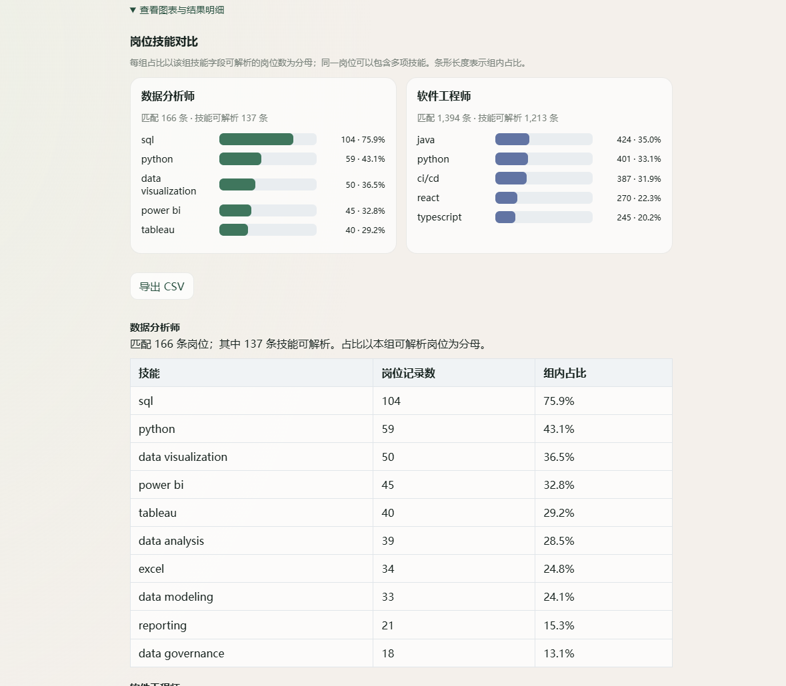
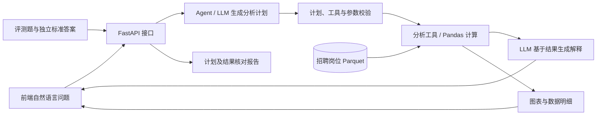

# DataAgent

招聘数据分析 Agent + 自动化质量评测平台。基于 **112,816 条招聘岗位记录**，将自然语言问题转换为分析计划，通过受控工具调用和 Pandas 计算，返回图表、数据明细与自然语言解释。

`Python` / `FastAPI` / `Pandas` / `Pydantic` / `JavaScript` / `pytest` / `LLM`

## 项目展示



实际查询页面：比较两类岗位的技能频次，展示匹配记录数、组内占比、条形图和 CSV 导出。[查看完整技能明细截图](docs/screenshots/skill-comparison-details.png)。

## 核心亮点

- **自然语言数据分析**：无需编写 SQL 或 Pandas，即可组合筛选岗位、地区、工作方式等条件，分析分类分布、比例、薪资与技能；最近 6 轮问答用于理解追问。
- **受控 Agent 分析链路**：LLM 理解问题并生成工具调用计划；Pydantic 校验计划结构，执行器校验工具、字段与参数，再由 Pandas 完成计算。统计数字来自工具结果，模型负责解释。
- **可解释分析**：页面可展开查看分析计划、筛选条件、工具调用、参考样本、统计明细和图表，并标注匹配记录数及技能统计分母。
- **自动化质量评测**：单元与接口测试配合正常分析、拒答与澄清、连续追问三类评测，验证计划、计算结果、异常处理和上下文延续。

## 使用示例

> 英国 Data Analyst 岗位最常见的技能有哪些？

```text
用户问题 → Agent 生成分析计划
  → filter_rows：country_clean 等于 United Kingdom
  → filter_rows：title 包含 Data Analyst
  → count_skills：解析技能列表，由 Pandas 统计频次
  → 返回技能排名、图表与自然语言结论
```

按上述工具链核对当前数据快照：匹配 **13 条**岗位，其中 **11 条**技能可解析；SQL 与 Python 各出现在 **7 条**记录中，占可解析记录的 **63.64%**。

同一岗位可包含多项技能，每条记录的同一技能最多计数一次。占比以技能可解析记录数为分母，不以全部匹配岗位数为分母。上方截图展示的是另一种用法：两类岗位分别筛选、独立统计后比较。

## Agent 工作流程 / 系统架构



**职责边界**：LLM 从已注册工具中选择操作并生成参数；工具执行筛选与统计，不执行模型生成的 Python 或 SQL。回答阶段使用本次工具结果作为依据，对话历史仅用于理解追问。模块关系与证据流见[架构说明](docs/architecture.md)。

## 数据分析能力

| 能力 | 当前实现 |
| --- | --- |
| 国家、公司与岗位统计 | 按字段统计非空值频次；岗位排行优先使用标准岗位名并排除全职/兼职异常标题；国家统计合并已知美国、英国别名 |
| 条件筛选 | 按岗位名称、公司、国家或技能等字段进行文本包含匹配，可连续筛选 |
| 组合筛选与分组比较 | 按岗位、地区、学历、经验、工作方式等字段取交集，分别计算两组分类频次与比例 |
| 技能频次 | 解析技能列表、规范化并在单条岗位内去重，返回频次和占比 |
| 两组技能比较 | 分别筛选两类岗位，保留各自的匹配数、可解析数与统计分母 |
| 数值概况 | 对有效数值计算均值、中位数、最小值和最大值；无有效值时提示限制 |
| 比例与薪资 | 报告可判定分母及未知数；薪资按指定币种和原始周期隔离，不换汇或自动年化 |
| 有限样本与日期 | 查看少量真实岗位或任职文本样本；将有效发布日期汇总到月份 |
| 数据查看与结果解释 | 数据概况、质量报告、记录预览；图表页展示国家、公司、岗位和技能分布 |

47 个原始字段的适用工具、可用记录数和限制见[字段分析能力与数据边界](docs/analysis-fields.md)。

## 自动化评测

| 评测项 | 结果 | 验证日期 |
| --- | --- | --- |
| 单元 / 接口测试 | **181 passed** | 2026-10-07 |
| 正常分析任务 | **7/7** | 2026-10-07 |
| 拒答与澄清 | **3/3** | 2026-10-07 |
| 连续追问 | **3/3 轮** | 2026-10-07 |

正常分析评测分别核对工具调用计划与计算结果，标准答案由原始数据独立计算，并校验数据文件摘要。拒答与澄清覆盖缺少数据、工具不支持和问题不明确；连续追问检查公司范围延续、流式回答及经验要求缺失的处理。

这些结果来自小规模回归用例，不代表任意问题上的总体准确率。JSON 报告保存在本地 `eval/reports/`（不纳入 Git），可在评测页面加载；判定口径见 [评测说明](eval/README.md)。

<details>
<summary>运行测试与评测</summary>

在项目根目录安装开发依赖并运行测试：

```powershell
& .\.venv\Scripts\python.exe -m pip install -r requirements-dev.txt
& .\.venv\Scripts\python.exe -m pytest tests -q
```

启动本地服务后运行完整评测。以下三条命令会调用已配置的模型并产生 API 用量：

```powershell
& .\.venv\Scripts\python.exe eval/run_benchmark.py
& .\.venv\Scripts\python.exe eval/run_unanswerable.py
& .\.venv\Scripts\python.exe eval/run_chat_benchmark.py
```

仅验证固定计划在真实数据上的执行结果，不调用模型：

```powershell
& .\.venv\Scripts\python.exe eval/run_benchmark.py --execution-only
```

</details>

## 数据来源

数据来自 NextGig 提供的 [Global Job Postings Multi-ATS Dataset](https://huggingface.co/datasets/NextGig-Rocks/global-job-postings-multi-ats)，按 [CC BY 4.0](https://creativecommons.org/licenses/by/4.0/) 授权。当前使用 `data/raw/nextgig_jobs_2026-06.parquet`，共 **112,816 条记录**。

仓库保留原始快照，运行时清洗国家别名和技能文本。数据代表 2026 年 6 月快照，并非实时招聘信息；来源方说明部分字段稀疏，岗位描述为模型生成的摘要，可能有误。本项目与来源方无隶属或背书关系。

## 技术栈

| 层级 | 技术与实现 |
| --- | --- |
| 后端 | Python / FastAPI / Pydantic |
| 数据分析 | Pandas / PyArrow / Parquet |
| Agent | OpenAI Python SDK 调用兼容的 Chat Completions 接口；JSON 计划、工具注册表与顺序执行器 |
| 前端 | HTML / CSS / JavaScript；自然语言对话、招聘数据图表、明细与 CSV 导出 |
| 测试与评测 | pytest / FastAPI TestClient / `eval` 脚本与 JSON 报告 |

## 本地运行

需要 Python 3.10 或更新版本。以下以 Windows PowerShell、项目位于 `D:\DataAgent` 为例：

```powershell
cd D:\DataAgent
py -3.10 -m venv .venv
& .\.venv\Scripts\python.exe -m pip install -r requirements.txt
if (!(Test-Path .env)) { Copy-Item .env.example .env }
```

已有 `.venv` 时跳过创建步骤。在 `.env` 中填写 `LLM_BASE_URL`、`LLM_MODEL` 和 `LLM_API_KEY`，使用支持 JSON 输出与流式回答的 OpenAI 兼容接口。真实密钥放在已被 Git 忽略的 `.env` 中。

确认数据文件 `data/raw/nextgig_jobs_2026-06.parquet` 存在，然后启动：

```powershell
.\run_dev.cmd
```

- [分析页面](http://127.0.0.1:8001/agent.html)
- [评测报告页面](http://127.0.0.1:8001/eval.html)
- [API 文档](http://127.0.0.1:8001/docs)

启动器使用 `127.0.0.1:8001`，监控后端 Python 文件并重启服务；修改前端后刷新页面即可。端口已占用时，使用已有服务或先停止它。

模型请求会向所配置的服务发送当前问题、最多 6 轮当前对话、查询统计结果及最多 8 条岗位样本。当前浏览器保存本地对话历史。

## 项目结构

```text
agent/       模型客户端、分析计划、回答生成与 Agent API
backend/     FastAPI 应用、数据读取、清洗与数据接口
data/        招聘数据快照及数据分析报告
frontend/    对话分析与评测报告页面
tools/       工具注册、参数校验和 Pandas 分析工具
eval/        评测题集、运行脚本及判定说明
tests/       单元、接口与回归测试
docs/        项目文档与展示截图
```

## API

| 方法 | 路径 | 用途 |
| --- | --- | --- |
| GET | `/dataset/overview` | 数据规模与字段概况 |
| GET | `/dataset/dashboard` | 招聘数据图表所需的真实统计汇总 |
| GET | `/dataset/quality` | 数据质量报告 |
| GET | `/dataset/preview` | 岗位记录预览 |
| GET | `/analysis/skills` | 按岗位关键词统计技能频次 |
| POST | `/agent/plan` | 生成分析计划或返回拒答 / 澄清原因 |
| POST | `/agent/execute` | 执行已有分析计划 |
| POST | `/agent/ask` | 完成规划、执行与回答生成 |
| POST | `/agent/ask/stream` | 流式返回分析进度、文字回答与最终结果 |

请求参数与响应结构见启动后的 [API 文档](http://127.0.0.1:8001/docs)。

## 项目边界

- 当前使用固定招聘数据快照，尚未接入实时采集、任意 CSV / Excel 上传或数据库查询。
- 分析范围由现有字段与工具决定；缺少必要信息时澄清，缺少数据或不支持的操作则说明限制，不支持薪资预测等任务。
- 文本筛选为包含匹配；国家别名归一尚未覆盖所有国家。薪资统计需要明确币种和周期，不能混合单位比较。
- 自然语言解释可能受模型、缺失字段和样本截断影响，应结合工具明细核对。本项目为个人开发项目，持续通过回归评测完善分析链路。
