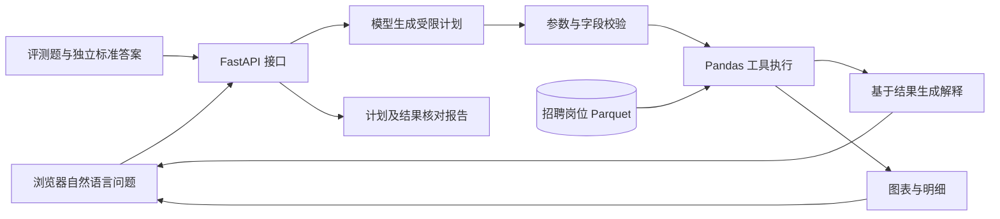

# DataAgent：招聘数据分析 Agent 与自动评测平台

DataAgent 是一个可在浏览器中演示的自然语言数据分析项目。用户提出问题后，模型生成受限的工具调用计划，Pandas 工具在招聘数据上执行计算，页面展示中文解释、数据依据、图表和分析步骤。评测脚本分别核对计划与计算结果。

当前版本使用一份固定的招聘岗位 Parquet 数据集（112,816 条记录）。**分析工具由代码定义，问题不是预置问答；评测题只是回归测试，并不限制用户提问。** 项目目前没有实现任意 CSV/Excel 上传、MySQL 查询或模型生成 SQL；这些属于后续扩展。

## 页面示例


图中比较 Data Analyst 与 Software Engineer 岗位的常见技能。每组的占比都以该组技能可解析的岗位记录数为分母；截图只展示一次查询的部分页面。[查看两组的完整技能明细截图](docs/screenshots/skill-comparison-details.png)。

## 功能与边界

- 自然语言筛选岗位，统计国家、公司和岗位名称；按岗位统计技能频次，或独立比较两类岗位的技能。
- 根据真实计算结果生成中文解释；当前对话最近 6 轮可用于理解追问，历史对话保存在当前浏览器。
- 展示工具计划、岗位参考样本、条形图和 CSV 导出。两组技能对比各用自己的可解析岗位数计算占比。
- 对缺失字段、不可支持的预测或含糊问题说明限制或请求澄清。
- 运行固定题集、连续追问及无法回答问题的评测，并在网页查看 JSON 报告。



模型负责选择工具和解释结果；岗位数量、技能频次与图表数值来自工具执行，不由模型直接编造。工具清单和参数校验位于 `tools/`，Agent 规划与回答位于 `agent/`。

## 数据来源

项目使用 [NextGig-Rocks 的 Global Job Postings Multi-ATS Dataset](https://huggingface.co/datasets/NextGig-Rocks/global-job-postings-multi-ats) 中的 `nextgig_jobs_2026-06.parquet`。数据由 NextGig 提供，按 [CC BY 4.0](https://creativecommons.org/licenses/by/4.0/) 授权；仓库保留原始 Parquet 快照，运行时对国家别名和技能文本进行清洗统计。该数据是 2026 年 6 月的历史快照，不代表实时招聘信息；来源页面也说明部分字段稀疏，岗位描述是模型生成的摘要，可能有误。DataAgent 是独立学习项目，来源方并未为本项目背书。

## 本地启动

需要 Python 3.10 或更新版本、PowerShell，以及可用的 OpenAI 兼容模型接口。在项目根目录运行：

```powershell
cd D:\DataAgent
py -3.10 -m venv .venv
& .\.venv\Scripts\python.exe -m pip install -r requirements.txt
Copy-Item .env.example .env
```

如果已经有 `.venv`，跳过创建虚拟环境。编辑 `.env`，填入 `LLM_BASE_URL`、`LLM_MODEL`、`LLM_API_KEY`。`.env` 已被 Git 忽略，不要提交真实密钥。模型请求可能发送当前问题、最多 6 轮当前对话的提问与回答、本次查询的统计结果和最多 8 条岗位记录样本给你配置的模型服务。

确认 `data/raw/nextgig_jobs_2026-06.parquet` 存在，再启动服务：

```powershell
.\run_dev.cmd
```

服务启动后访问 [智能分析页面](http://127.0.0.1:8001/agent.html)、[评测报告页面](http://127.0.0.1:8001/eval.html) 或 [API 文档](http://127.0.0.1:8001/docs)。开发启动器使用本机 `127.0.0.1:8001`；若端口被占用，请使用已有服务或先停止它。保存后端 Python 文件会触发开发服务重启，修改前端 HTML 后需刷新浏览器。

## 面试演示

完整的 5 分钟讲解与操作顺序见 [演示脚本](docs/demo.md)；简历描述和常见技术追问见 [面试准备](docs/interview.md)。建议从一个**未写入固定评测集**的问题开始：

> 英国的 Data Analyst 岗位最常见的技能有哪些？

一次实测中，Agent 依次用 `country_clean` 筛选英国、用 `title` 筛选 Data Analyst，再调用 `count_skills`；得到 13 条匹配岗位。回答文字由模型生成，实际运行时应以页面展示的工具步骤和数值为准。然后演示两类岗位技能对比、无法回答问题，以及评测报告。演示时说明“固定题集验证质量，但用户提问没有固定模板”。

## 测试与评测

安装开发依赖后运行：

```powershell
& .\.venv\Scripts\python.exe -m pip install -r requirements-dev.txt
& .\.venv\Scripts\python.exe -m pytest tests -q
```

正常分析评测需要运行中的本地服务，并会对每道题调用一次模型：

```powershell
& .\.venv\Scripts\python.exe eval/run_benchmark.py
& .\.venv\Scripts\python.exe eval/run_unanswerable.py
& .\.venv\Scripts\python.exe eval/run_chat_benchmark.py
```

如只想核对固定计划在真实数据上的执行，不调用模型：

```powershell
& .\.venv\Scripts\python.exe eval/run_benchmark.py --execution-only
```

最近一次本地验证：`pytest` **82 项通过**；正常分析评测 **7/7 通过**（2026-10-05）。最近保存的拒答与澄清报告为 **3/3**，连续追问报告为 **3/3**（2026-10-04）。这些都是小规模回归结果，**不代表任意问题上的总体准确率**；模型规划可能随接口和模型版本变化。报告写入 `eval/reports/`，该目录不纳入 Git。详细判定口径见 [评测说明](eval/README.md)。

## 接口与目录

| 接口 | 用途 |
| --- | --- |
| `GET /dataset/overview`、`/dataset/quality`、`/dataset/preview` | 数据概况、质量与预览 |
| `GET /analysis/skills` | 按关键词分析技能 |
| `POST /agent/plan` | 生成分析计划 |
| `POST /agent/execute` | 执行已有计划 |
| `POST /agent/ask`、`/agent/ask/stream` | 提问并获取完整或流式结果 |

```text
agent/       模型客户端、规划、回答与 API
backend/     FastAPI、数据读取与数据清洗
data/        招聘岗位数据
frontend/    智能分析与评测网页
tools/       受限 Pandas 工具和执行器
eval/        固定题集、运行脚本及报告说明
tests/       单元测试与接口测试
docs/        开发与演示文档
```

技术栈：Python、FastAPI、Pandas、Pydantic、HTML/CSS/JavaScript、pytest，以及 OpenAI 兼容模型接口。
