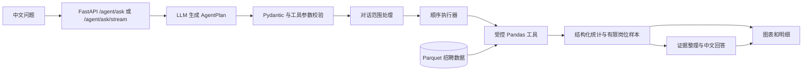

# DataAgent 架构说明

DataAgent 将问题理解和文字解释交给 LLM，岗位筛选与统计交给受控的 Pandas 工具。浏览器通过 FastAPI 访问固定的 2026 年 6 月招聘数据快照。

- `agent/llm_client.py` 依据当前问题、字段目录和已注册工具生成计划；`agent/schemas.py` 校验计划结构。`agent/context_scope.py` 处理连续追问的范围继承。
- `tools/executor.py` 只允许注册工具及其参数；`agent/runtime.py` 按顺序执行。只有筛选步骤改变后续工具的数据范围，统计结果不会替换岗位记录。
- `tools/analysis_tools.py` 与 `tools/pandas_tools.py` 基于数据集计算数量、技能比例、分类分布和薪资。岗位排行排除仅表示全职/兼职的异常标题；技能比例以该组技能可解析的岗位为分母。
- `agent/answers.py` 限制送给 LLM 的证据量。职责与任职要求按对应文本字段抽取有限样本；样本观察不能写成全部岗位的共同要求。前端显示分析计划、图表、明细和中文解释。
- `eval/` 分别评测正常分析、拒答/澄清及连续追问；`tests/` 检查工具、接口和回归场景。评测题集较小，不能外推为所有问题的准确率。

当前系统使用固定 Parquet 快照；没有实时采集、任意数据上传或通用 SQL 执行。模型服务故障时已有结构化结果仍可返回，但自然语言解释可能退回简短提示。
